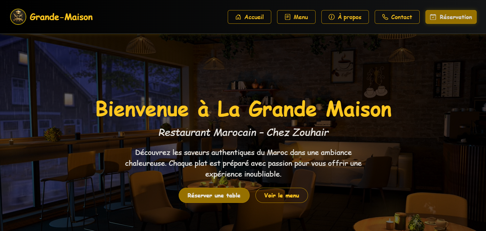
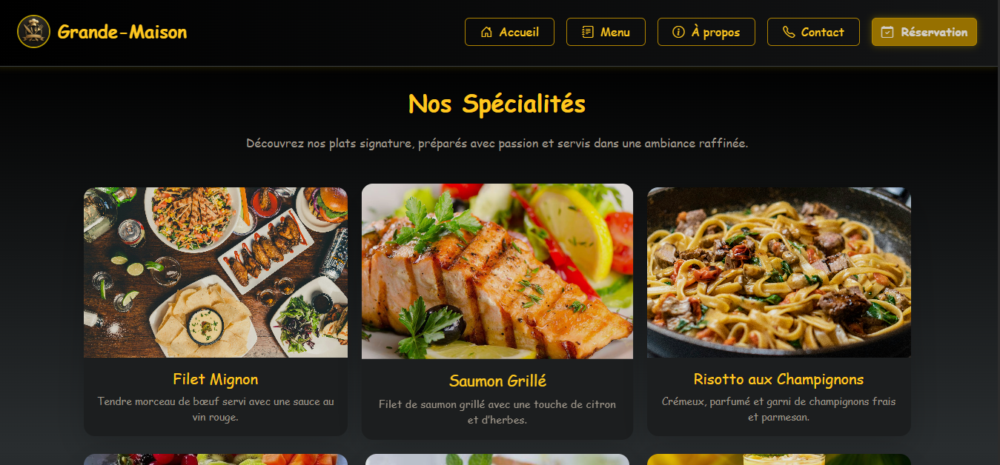
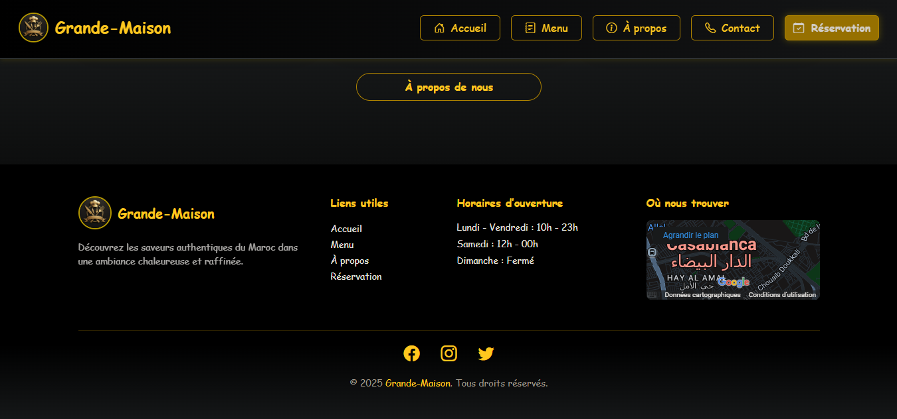
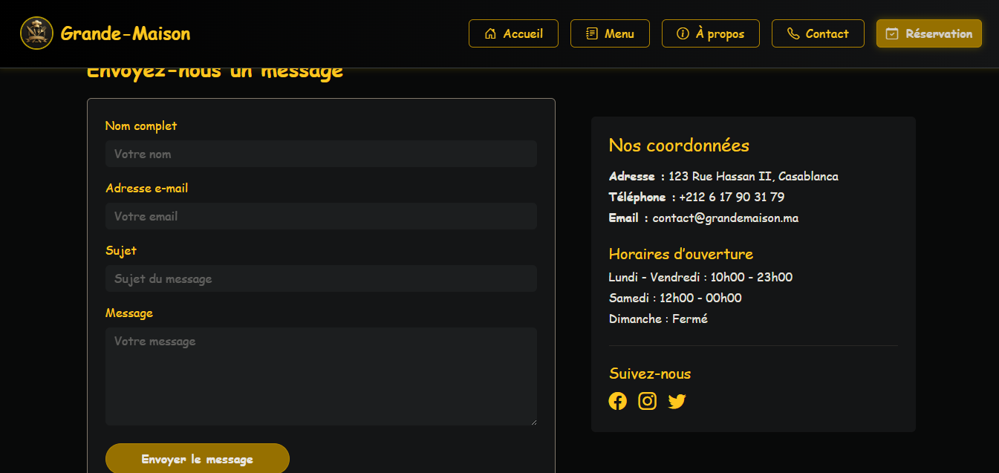
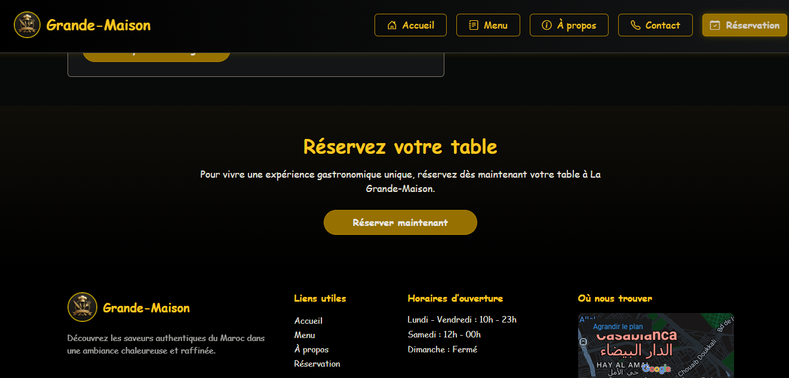
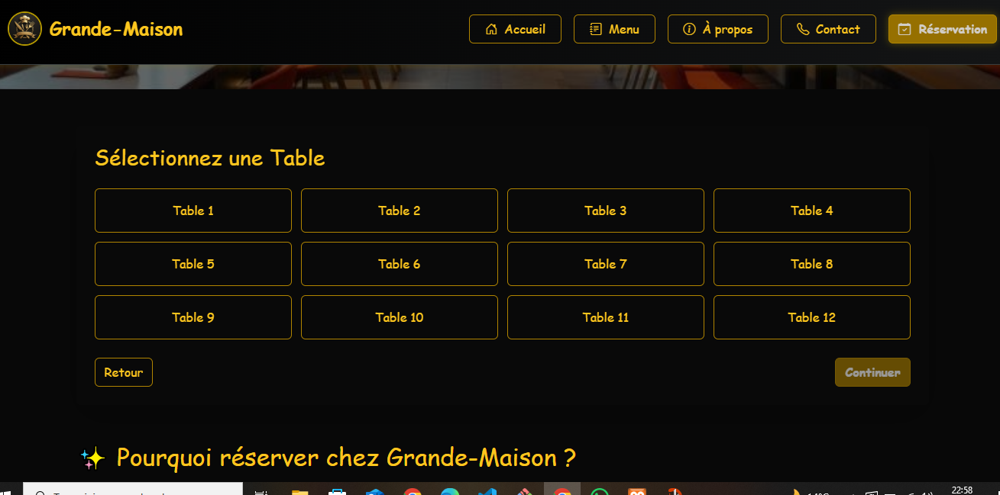
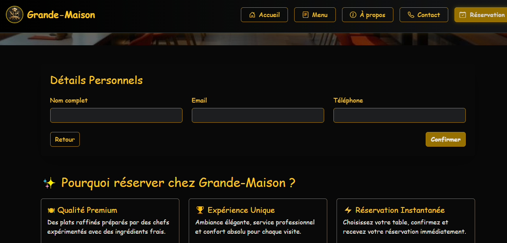
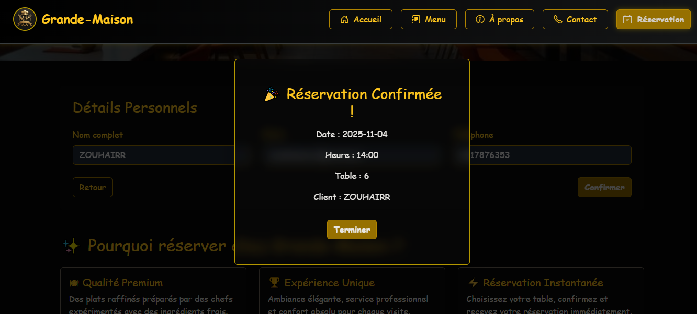

# Mini-Projet — Interface de Réservation (Frontend)

Description
-----------
Ce dossier contient l'interface frontend d'un mini-projet de réservation développé avec React. L'application permet de naviguer entre plusieurs sections (accueil, réservation, contact, à propos), de remplir un formulaire de réservation, et d'afficher des informations liées aux offres.

Principales fonctionnalités
---------------------------
- Navigation entre pages (`Accueil`, `Reservation`, `Contact`, `Propos`).
- Formulaire de réservation avec champs de base (nom, email, date, détails).
- Structure responsive (Bootstrap + CSS personnalisé) pour mobile/tablette/desktop.
- Composants réutilisables: `Header`, `Footer`, `Menu`, `Section`.

Technologies
------------
- Frontend: `React` (JSX)
- Markup & Styles: `HTML`, `CSS`, `Bootstrap`

Installation & exécution
-----------------------
Depuis la racine du projet (`c:\Users\pc\Desktop\dossier-react`) :

```powershell
npm install
npm start
```

Le projet s'exécute en développement sur `http://localhost:3000` par défaut. Assure-toi que `src/index.js` ou `src/App.js` importe/monte les composants correspondant au dossier `src/Mini-projet-Reservatiion` si tu veux charger ce mini-projet en particulier.

Arborescence importante
----------------------
Voici les fichiers principaux situés dans `src/Mini-projet-Reservatiion` :

- `App.jsx` — composant local principal (si utilisé directement).
- `Accueil.jsx` — page d'accueil.
- `Reservation.jsx` — formulaire et logique de réservation (frontend).
- `Header.jsx`, `Footer.jsx`, `Menu.jsx` — composants de structure et navigation.
- `Contact.jsx`, `propos.jsx`, `Section.jsx` — pages et sections complémentaires.
- `images/` — captures et vignettes utilisées dans le README et dans l'UI.
- `vid_projet/` — vidéo de démonstration (`projet1vid.mp4`).

Usage rapide
-----------
- Ouvrir le navigateur sur `http://localhost:3000`.
- Naviguer vers la route correspondant au composant `App` qui charge les pages du mini-projet.
- Remplir le formulaire de `Reservation` et vérifier les comportements (validation simple, affichage). Note: il n'y a pas de backend inclus par défaut — les réservations sont gérées côté client.

Galerie (captures)
------------------
Les images suivantes sont fournies dans le dossier `images/` pour montrer l'interface :


*Accueil — vue générale et accès aux sections.*


*Navigation principale et header.*


*Formulaire de réservation (exemple d'UI).* 


*Section descriptive avec détails de l'offre.*


*Page contact et pied de page.*


*Variantes d'affichage.*


*Affichage mobile (responsive).* 


*Extraits visuels: composants et styles.*

Démo vidéo
----------
Lecture locale de la vidéo :

<video controls width="640">
	<source src="vid_projet/projet1vid.mp4" type="video/mp4">
	Votre navigateur ne supporte pas la lecture vidéo.
</video>

Remarques et suggestions d'amélioration
-------------------------------------
- Intégrer un backend (API REST) pour persister les réservations et ajouter une base de données.
- Ajouter une validation plus complète côté client et serveur.
- Améliorer l'accessibilité (ARIA, contrastes) et ajouter des tests unitaires pour les composants.
- Optimiser les images (thumbnails) et la galerie pour améliorer la performance.

Contribution
------------
Si tu souhaites améliorer ce mini-projet :

1. Fork le dépôt.
2. Crée une branche feature (`git checkout -b feature/ma-amelioration`).
3. Fais tes changements et ouvre une pull request.

Licence
-------
Licence à définir (ajoute `LICENSE` si tu veux une licence explicite — par exemple `MIT`).

Auteur & contact
----------------
Projet local : dossier `src/Mini-projet-Reservatiion`.

---

> Si tu veux, je peux aussi :
- Mettre la galerie en grille responsive (grid CSS / Bootstrap).
- Générer des miniatures et un visionneur (lightbox) pour les images.
- Traduire ce README en darija ou en anglais.

# Mini-Projet: Réservation (Frontend)

Ce dépôt contient la partie frontend d'un mini-projet de réservation développé avec React. Le code fourni dans ce dossier représente une interface simple pour parcourir les sections, faire une réservation, et voir les informations de contact.

**Technologies utilisées:** React, HTML, CSS, Bootstrap (pour la mise en forme rapide).

**Emplacement:** `src/Mini-projet-Reservatiion`

**Fichiers principaux:**
- `App.jsx` - point d'entrée local du composant (dans ce dossier).
- `Accueil.jsx` - page d'accueil / présentation.
- `Reservation.jsx` - composant de réservation.
- `Header.jsx`, `Footer.jsx`, `Menu.jsx` - structure et navigation.
- `Contact.jsx`, `propos.jsx`, `Section.jsx` - pages et sections supplémentaires.

**Installation & Exécution (depuis la racine du projet React)**

Ouvrez un terminal (PowerShell) à la racine du projet (`c:\Users\pc\Desktop\dossier-react`) puis:

```
npm install
npm start
```

Le serveur de développement démarre (généralement sur `http://localhost:3000`). Naviguez vers la route qui charge ce mini-projet (selon votre configuration d'import des composants dans `src`/`index.js` ou `App.js`).

**Galerie & Présentation rapide**

Voici quelques captures / vignettes du projet. Sous chaque image se trouve une courte présentation.


*Accueil: présentation du site et accès rapide aux sections principales.*


*Barre de navigation et en-tête avec logo/menu.*


*Formulaire de réservation — champs de saisie et bouton de soumission.*


*Section descriptive: informations et images liées à l'offre.*


*Page contact et pied de page avec coordonnées.*


*Autres écrans et variantes d'affichage.*


*Exemple d'affichage mobile / responsive.*


*Extraits visuels de composants et styles (bootstrap + css perso).*

**Vidéo de démonstration**

<video controls width="640">
	<source src="vid_projet/projet1vid.mp4" type="video/mp4">
	Votre navigateur ne supporte pas la lecture vidéo.
</video>


**Conseils / suites possibles**
- Intégrer un backend (API) pour persister les réservations.
- Ajouter une validation plus poussée côté client et affichage des erreurs.
- Ajouter des tests unitaires pour les composants critiques.

Si tu veux, je peux:
- Mettre en forme la galerie en grille responsive.
- Générer de petites vignettes (thumbnails) et les lier pour ouvrir les images en grand.
- Traduire entièrement le README en arabe/darija si tu préfères.

---

Auteur: Projet local — dossier `src/Mini-projet-Reservatiion`.

